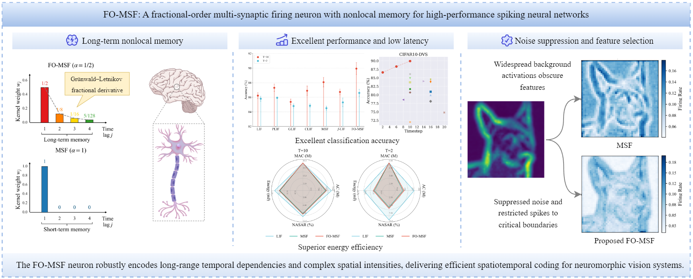
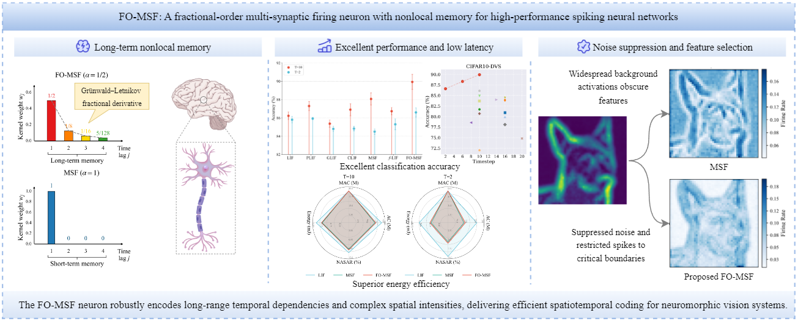

<h1>FO-MSF: A fractional-order multi-synaptic firing neuron with nonlocal memory for high-performance spiking neural networks</h1>

  

## Graphical abstract

- This is the repository for paper *FO-MSF: A fractional-order multi-synaptic firing neuron with nonlocal memory for high-performance spiking neural networks*.

  

## Comparison with recent methods

  

## Prerequisites
- Ubuntu 22.04.5
- Python 3.10
- Pytorch 2.8.0
- Cuda 11.8
- Numpy 2.2.6
- Spikingjelly 0.0.0.0.14

## Dataset download links
- N-Caltech101: https://www.garrickorchard.com/datasets/n-caltech101
- CIFAR10-DVS: https://figshare.com/articles/dataset/CIFAR10-DVS_New/4724671
- CIFAR10: https://www.cs.toronto.edu/~kriz/cifar-10-python.tar.gz 
- CIFAR100: https://www.cs.toronto.edu/~kriz/cifar-100-python.tar.gz 

## Note

- [ ] The code will be released in stages. If you have any questions, feel free to send an email to `qingyangswu(AT)gmail DOT com`. I will respond to you as soon as possible. Let us work together to contribute to the development of spiking neural networks.
